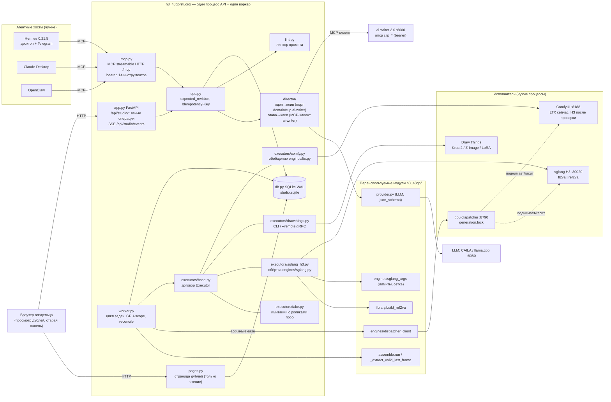
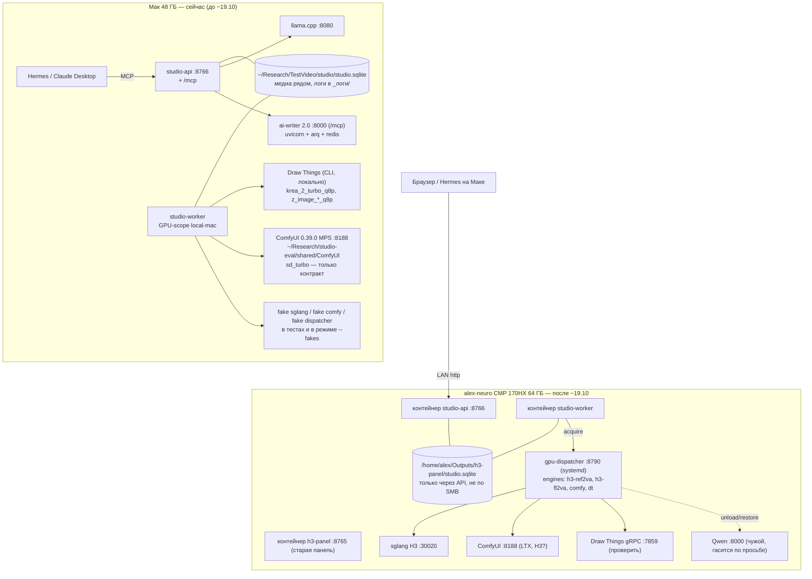
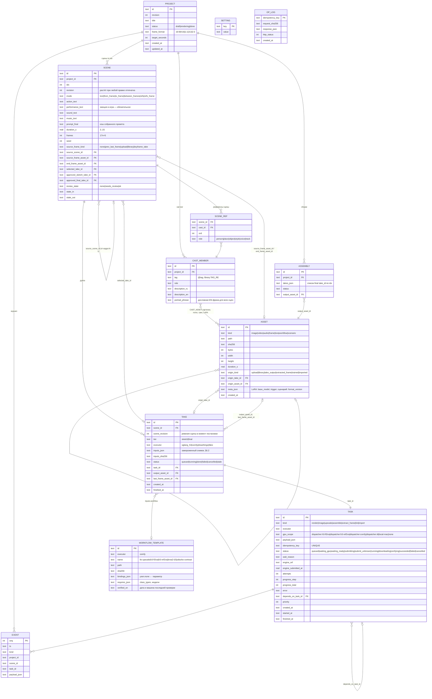
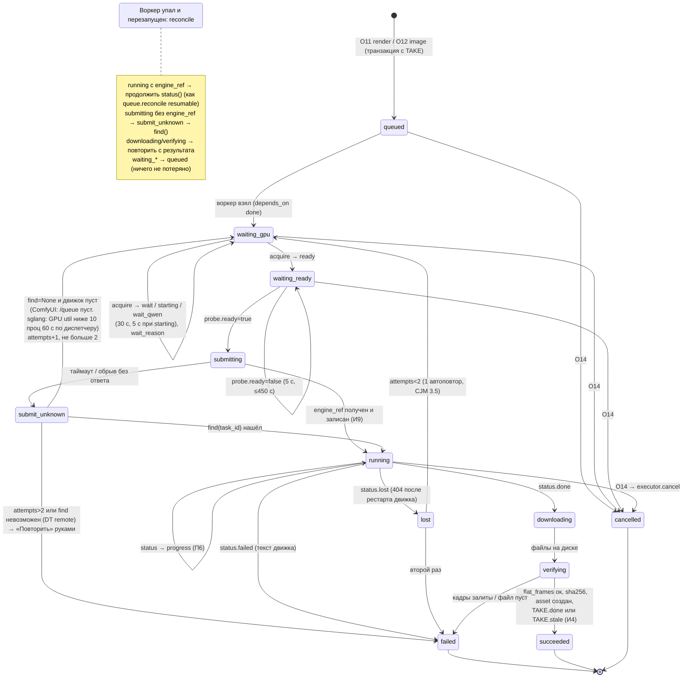
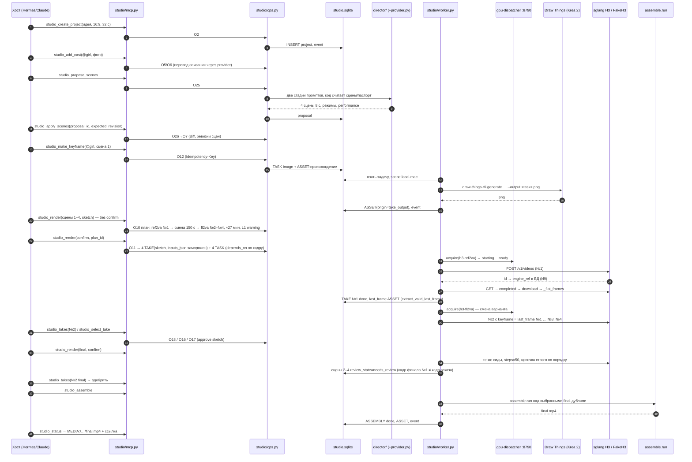
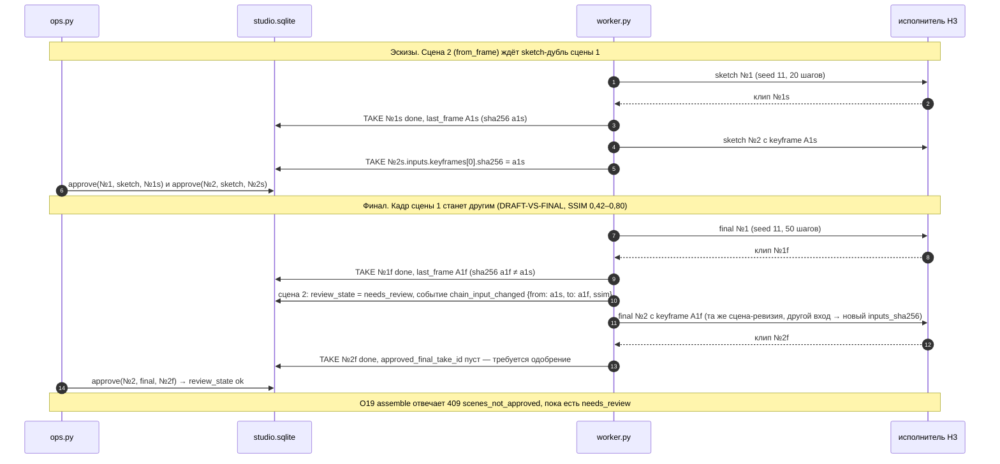

# Студия, часть 1: ядро, исполнители, режиссёр, MCP — спека

Дата: 2026-10-10. Статус: **спека на проверку не автором** (CLAUDE.md: план против спеки проверяет
тот, кто его не писал). Код не написан. Автор: Claude Fable 5.1 по заданию владельца.

Источники решений, которые здесь не пересматриваются:
- видение `2026-10-09-studio-vision.md` (+§5а) и его ревью `vision-review/{SUMMARY,codex,codex-2-hermes,fable}.md`;
- ландшафт `docs/research/2026-10-09-studio-landscape/README.md` (итог 10.10: свой тонкий слой;
  исполнители ComfyUI / Draw Things / sglang; режиссёр ai-writer 2.0; MCP по образцу ArcReel и comfyui-mcp);
- решения владельца `2026-10-08-panel-wave2-DRAFT.md` §4 (Р1–Р9) и стек `docs/design/2026-10-panel-audit/WAVE2-STACK.md`;
- путь пользователя `2026-10-09-panel-wave2-CJM.md` (П1–П7, пять ставок приняты);
- факты о H3: `docs/h3-modes/{README,MATRIX,DRAFT-VS-FINAL,PROMPT-FORMAT,GAIT-SOUND}.md`.

Обозначения: «ч» — человек (владелец), «с» — система. Пути без корня — относительно этого репо.
Пометка **(ставка)** — решение без замера, проверяется в срезе или в день с GPU.

---

## 1. Цель и критерий готовности

**Цель части 1.** Ядро студии, с которым владелец сам, без ssh/curl/правки файлов, проходит путь
«идея → сцены → эскиз первого кадра → эскизы сцен → выбор дубля → финал → сборка → mp4», где
исполнители подключены по одному договору, состояние живёт в одной базе, задачи переживают обрывы,
а любой MCP-хост (Hermes, Claude Desktop, OpenClaw) и будущий мастер (часть 3) работают через один и
тот же набор явных операций.

**Критерий готовности (один).** До возврата alex-neuro (~19.10) владелец проходит путь выше на Маке:
из Claude Desktop или Hermes (MCP-инструменты, §11) плюс страница просмотра дублей (§4.4), с
настоящим Draw Things (Krea 2 Turbo) для кадра и **имитацией H3** (§12), отдающей ролики проб
08–09.10 из `~/Research/TestVideo/h3-modes/`. Путь закреплён контрактным тестом (§12.3) на тех же
имитациях, и тот же тест в первый день с GPU выполняется на настоящих sglang/ComfyUI (§15).
Проход владельца — отдельно и обязательно; тест проверяет, что путь есть, а не что им удобно
пользоваться.

Срезы §14 — каждый со своей приёмкой владельцем; часть считается сделанной после среза S9.

## 2. Не-цели части 1

| Не делаем | Где это будет |
|---|---|
| React-мастер, 390 px, темы, «Готовое» как раздел | часть 3 (`CJM` экраны 1–15) |
| Vision-критик, автопересъёмка | часть 2; сейчас только линтер промпта (§10) |
| MCP Apps (`ui://` виджеты) | после мастера, слой 2 (SUMMARY §«Хосты») |
| Граф цепочек, карточки-DSL узлов, маршрутизация по нескольким машинам | отвергнуто ревью (SUMMARY п.7); адрес узла — строка в настройках |
| Обучение LoRA (Z-Image / Krea 2 Raw) | LoRA в части 1 — только ресурс с происхождением (§6), обучение — отдельная задача после GPU |
| Wan, YuE2, клип под трек («Сюжет» 16–40 сцен) | волна 3 (Р3) |
| Перенос старых `project.json` в SQLite | часть 3 вместе с мастером (Р8: разовый импорт, файлы — архив); старая панель живёт |
| Авторизация и доступ из интернета | до любого мобильного хоста (fable §2б); в части 1 — LAN и bearer на MCP |
| Свой чат | не пишем (SUMMARY п.3) |

---

## 3. Ключевое решение: эволюция в этом репо (strangler), не новый пакет

**Решение: студия растёт в этом репо как пакет `h3_48gb/studio/` рядом с `web.py`, новое
FastAPI-приложение на своём порту, доменные модули переиспользуются через узкие швы, существующие
тесты остаются контрактом.** Ставка владельца принимается; ниже — почему она верна и где её граница.

### 3.1. Что именно переиспользуется (пути:строки)

| Модуль | Строк | Тестов | Что берём и как |
|---|---|---|---|
| `h3_48gb/engines/ltx.py` | 274 | 22 (`tests/test_ltx_upscale.py`) | `ComfyClient` (upload/prompt/history/interrupt, `:55-100`), цикл опроса `/history` с `MAX_ODD_HISTORY_POLLS=12` (`:31`, `:150-168`), `set_scene_ltx_if_current` (`:252`) — образец «поздний результат не затирает». Обобщается в `studio/executors/comfy.py` (§8.1); `upscale_part` вызывает обобщённый клиент, тесты проходят без правок |
| `h3_48gb/engines/sglang.py` | 348 | 22 (`tests/test_sglang_adapter.py`) | `SglangClient` (`:87-158`), `build_payload` (`:160-178`), `run_generate` (`:239-348`): возобновление по `engine_ref`, `LOST_RETRIES=5`, проверка залитых кадров `_flat_frames`. Шов: два прямых вызова `q.cancel_reason`/`q.set_running_fields` заменяются параметром `store` (§8.3) |
| `h3_48gb/engines/sglang_args.py` | 233 | `tests/test_sglang_args.py` | лимиты и сетка: `MIN_SECONDS=3`, `MAX_SECONDS=15`, `grid_frames_up` 17n+5 (`:81-83`), `DEFAULT_MAX_REF_IMAGES=5` (`:24`, проба 07.10: 6 портретов на 10 с = 63,6 из 64,9 ГБ), `TASKS=("ref2va",)` (`:32`) — расширяется до трёх задач |
| `h3_48gb/engines/dispatcher_client.py` | 77 | 26 (`tests/test_gpu_gate.py`) | как есть: `acquire/release/status`, таймауты 130/10 с, клиенты `panel-worker`/`panel-web` — добавляется `studio-worker` |
| `h3_48gb/worker.py` | 1308 | 64 | `make_gpu_gate` (`:524-597`): цикл acquire каждые 30 с, 5 с при `starting`, тепловой порог 80→72 °C; `_IdleRelease` (`:603`). Берётся функцией, не процессом: у студии свой цикл воркера (§4.2) |
| `h3_48gb/library.py` | 331 | 17 + `test_library_web` | `build_ref2va` (`:272-325`): нумерация `<Subject N>`/`<Picture k>`/`<Audio k>`, `subject_definitions`. Вызывается с картами из SQLite через тот же словарный вид карточки |
| `h3_48gb/assemble.py` | 1806 | 68 | `run()` (`:700`, склейка/заморозка/звук/ffmpeg), `_extract_last_frame` (`:1258`), `_extract_valid_last_frame` (`:593`, пропуск битого хвоста) — вызываются как функции над путями; `advance_project`/`_submit_next_scene_sglang` **не** берутся (их логика «один дубль на сцену» уходит, §6) |
| `h3_48gb/engines/estimate.py` | 64 | — | история времени `sglang-history.jsonl`, `estimate_seconds` — переезжает в таблицу `estimate_sample` с той же формулой |
| `h3_48gb/provider.py` | 1046 | `tests/test_provider.py` | OpenAI-совместимый клиент со строгой `json_schema`, SSE против обрыва шлюза, `LlamaLocal` — слой LLM режиссёра (§9.2) |
| `h3_48gb/queue.py` | 1347 | 98 | **не переиспользуется как хранилище** (очередь уходит в SQLite, Р-STACK §4), но его таблица `reconcile` (`:1161-1250`: lease / marker / mp4 / engine_ref) переносится как спецификация состояний задачи (§8.5) и как тесты точным равенством |
| `tools/gpu-dispatcher/dispatcher.py` | 619 | `tests/test_gpu_dispatcher.py` | хост остаётся единственным владельцем `generation.lock`. Правка одна: `engine_specs()` (`:65-85`) получает `h3-fl2va` рядом с `h3-ref2va` и `dt` (§8.4) |
| `tests/_fake_{comfy,sglang,dispatcher,llama}.py` | — | — | имитации уже есть; дописываются ролики проб и тайминги (§12) |

Итого: ≈5,5 тыс. строк доменного кода и ≈380 тестов с проверенными инвариантами (порядок
«лиза → маркер → снятие лизы» `worker.py:936-960`; «маркер важнее mp4» `queue.py:1176,1230-1236`;
«поздний апскейл не крепится к новому дублю» `ltx.py:252`; 17n+5-сетка; нумерация `<Picture k>`).
Новый пакет повторил бы эти ошибки заново — именно этот класс находок закрывали семь раундов ревью
04–11.08 (CLAUDE.md).

### 3.2. Где эволюция кончается

Новое, не наследуемое: модель «сцена с ревизией → неизменяемые дубли» (у `project.py` один
`clip_path` на сцену и `invalidate_scene_chain` стирает его, `project.py:827-898`); очередь и
задачи в SQLite; исполнитель как договор (§8); события как таблица. `web.py` (6779 строк) не
трогается и не импортируется студией. Эти части пишутся заново в `h3_48gb/studio/`.

### 3.3. Отвергнутые варианты

| Вариант | Почему нет |
|---|---|
| Новый пакет/репо «studio» с нуля | потеря ≈380 тестов-инвариантов; оценка переписывания ядра DRAFT §2 — 35–55 дней при цели «контент сейчас» (fable §5) |
| ArcReel или Toonflow как основа | проверено руками 10.10: ArcReel — AGPL, нет продолжения от кадра (`extract_video_last_frame` не вызывается), нет русского, агент не работает с локальной Qwen; Toonflow — холст, нет сборки, нет тестов; «основой 2–3 недели против тонкого слоя» (`eval-toonflow.md`) |
| AI Movie Studio 2 | затих с 16.09 (README ландшафта) |
| Мак как настоящий исполнитель H3 на MLX (`engine.py: ENGINES=("mlx","sglang")`) вместо имитации | Мак заморожен для рендера с 01.10 (память владельца); прогон 1344×768 10.08 закончился kernel panic (CLAUDE.md). Имитация с роликами проб дешевле и безопаснее |
| Доработка `web.py` на месте (без FastAPI) | STACK §1: ручной роутинг — источник находок «400 вместо 404»; решение владельца — FastAPI |
| Prefect / LangGraph для цепочек | codex: преждевременно; одна зависимость `depends_on` |
| SQLAlchemy + Alembic (как в ai-writer) | 11 таблиц, один пользователь; `sqlite3` из stdlib + миграции SQL-файлами по `PRAGMA user_version` держат `requirements-panel.txt` коротким (образ без MLX, спека W1 §3.2) |
| Redis/ARQ для очереди | STACK §4: GPU один, задач единицы в час |

---

## 4. Архитектура

### 4.1. Компоненты и границы



Границы:
- **Единственный источник состояния — `studio.sqlite`.** Хост хранит только разговор (SUMMARY п.4).
  ai-writer хранит книгу; студия импортирует его сценарий как ресурс с происхождением, обратной
  синхронизации нет (codex-2 §4).
- **MCP-сервер — обёртка над `ops.py` без своей логики.** Любой инструмент = одна операция API.
- **Исполнители — чужие процессы.** Студия не загружает модели и не запускает графы; поднимает и
  гасит движки на alex-neuro только диспетчер.
- **Воркер — один процесс, одна задача за раз на GPU-scope.** Брокера нет.

### 4.2. Процессы

| Процесс | Запуск | Что делает | Падение |
|---|---|---|---|
| `studio-api` | `python -m h3_48gb.studio api --port 8766 --outdir $H3_OUTDIR` | FastAPI + MCP в одном процессе (как `/mcp` в ai-writer); SSE; страница дублей | перезапуск; воркер не замечает (DB — на диске) |
| `studio-worker` | `python -m h3_48gb.studio worker --outdir $H3_OUTDIR` | `reconcile` → взять задачу → GPU-scope → исполнитель → результат → событие; один экземпляр под `flock worker.lock` (как `worker.py:105`) | при старте `reconcile` по `engine_ref` (§8.5); задачу не повторяет вслепую |
| `gpu-dispatcher` (alex-neuro) | systemd, уже есть | владелец движков и `generation.lock` | `KillMode=process`, движки живут |
| исполнители | диспетчер (alex-neuro) / вручную (Мак) | см. §8 | задача → `waiting_ready`, не ошибка |

На alex-neuro оба процесса студии — два контейнера compose (`studio-api`, `studio-worker`) по
STACK §5, со своими healthcheck; старый `h3-panel` остаётся на :8765 до приёмки части 3 (Р6).
На Маке — два процесса в venv (Docker на Маке не нужен).

### 4.3. Развёртывание по машинам и портам



Порты: 8765 старая панель, **8766 студия (ставка, вопрос 2 §17)**, 8188 ComfyUI, 30020 sglang,
8790 диспетчер, 7859 Draw Things gRPC, 8000 Qwen на alex-neuro / ai-writer на Маке (разные машины,
коллизии нет), 8080 llama.cpp на Маке.

### 4.4. Страница дублей (минимум, без React)

`studio/pages.py`: три серверных HTML-страницы на f-строках (без шаблонизатора и сборки):
`/studio/projects/<id>` (сцены, статусы, план очереди), `/studio/scenes/<id>/takes` (дубли с
`<video controls>` и кнопкой «Выбрать» — единственное действие, POST с `expected_revision`),
`/studio/projects/<id>/result` (финал, «Скачать»). Медиа отдаются с Range (`/studio/media/<asset_id>`).
Это не мастер (часть 3), а окно, в которое ссылаются MCP-инструменты (fable 2а: «виджет = страница
панели»). Проверяется скриншотом на 1440 и 390 px: без горизонтальной прокрутки.

---

## 5. Стек

| Слой | Выбор | Версия | Почему | Отвергнуто |
|---|---|---|---|---|
| Язык | Python | 3.12 (`pyproject: requires-python >=3.12`) | весь домен уже на нём | — |
| HTTP API | FastAPI + Pydantic 2 + uvicorn | `fastapi>=0.143`, `pydantic>=2.9`, `uvicorn>=0.30` (как в ai-writer, проверено там) | STACK §1: модели запросов, единый обработчик ошибок, OpenAPI как источник типов для MCP и клиента | stdlib `http.server` (источник находок волн 1–1.5) |
| Хранилище | SQLite, `sqlite3` stdlib, WAL, `busy_timeout=5000` | SQLite ≥3.35 (`RETURNING`) | STACK §3; один файл, транзакция «задача + ревизия сцены» | Postgres, SQLAlchemy/Alembic (§3.3) |
| Миграции | SQL-файлы `studio/migrations/NNN.sql`, `PRAGMA user_version` | — | 11 таблиц, читается глазами | Alembic |
| Бэкап | `sqlite3.Connection.backup()` раз в час в `<outdir>/backup/studio-<ts>.sqlite`, 7 копий | — | codex: копия файла при WAL несогласованна | `cp` файла |
| Очередь | таблица `task` в той же БД + `flock worker.lock` | — | STACK §4 | Redis/ARQ, каталоги `pending/running` |
| События | таблица `event` (seq, монотонный) → SSE `Last-Event-ID` = seq | — | DRAFT (г): один журнал для SSE, MCP, уведомлений, отчёта боя | опрос `/api/state` |
| HTTP-клиенты к исполнителям | `urllib` в воркере (синхронно, как `ltx.py`/`sglang.py`) | stdlib | один поток, одна задача; меньше зависимостей | httpx/aiohttp |
| Прогресс ComfyUI | `websockets` (клиент `ws://…/ws?clientId=`) с откатом на опрос `/history` | `websockets>=12` | счётчик шагов для П6 (Н7); опрос — как сейчас | только опрос |
| MCP | `mcp` (FastMCP, streamable HTTP, монтируется в FastAPI) | `mcp>=2.3` (как в ai-writer) | один процесс с API; тот же паттерн, что `backend/app/mcp_server` ai-writer | отдельный контейнер `h3-mcp` (W1 §7) — лишний процесс |
| MCP-клиент к ai-writer | тот же `mcp` | — | `clip_*` инструменты | REST с cookie-сессией |
| LLM | `provider.py` (OpenAI-совместимый, `json_schema`) | — | Р1: идеи ai-writer копируются, общего пакета нет | PydanticAI (codex) — позже, если появится третья роль |
| Медиа | ffmpeg/ffprobe из `assemble.py` | как в образе | уже есть | — |
| Хеши | `hashlib.sha256` файлов и канонического JSON входов | stdlib | неизменяемые дубли | — |
| Тесты | pytest ≥8; имитации `tests/_fake_*.py`; контракт против живых ComfyUI/Draw Things на Маке | — | CLAUDE.md: тест виден красным | Playwright — часть 3 |
| Клиент | нет (f-string HTML, §4.4) | — | мастер — часть 3 на React (STACK §2) | — |

Зависимости студии добавляются в `requirements-panel.txt`: `fastapi`, `pydantic`, `uvicorn`,
`websockets`, `mcp`. MLX-стек по-прежнему не импортируется.

---

## 6. Модель данных (SQLite)



### 6.1. Инварианты (каждый — тест точным равенством)

| # | Инвариант | Где держится |
|---|---|---|
| И1 | `scene.revision` растёт на 1 при изменении любого поля отпечатка: `mode, action_text, performance_text, sound_text, music_text, duration_s, seed, source_frame_*, end_frame_asset_id, SCENE_REF, tier-независимые параметры`. Правка `title` проекта ревизию сцены не трогает | `ops.update_scene` в одной транзакции |
| И2 | `TAKE.inputs_json` пишется один раз при постановке и **никогда не обновляется**; `UPDATE take SET inputs_json` запрещён триггером `RAISE(ABORT)` | миграция 001 |
| И3 | Результат крепится к дублю, не к сцене. `scene.selected_take_id` может указывать только на дубль с `scene_revision = scene.revision`; при росте ревизии выбор очищается и пишется событие `selection_cleared` | триггер + `ops.update_scene` |
| И4 | Поздний результат: задача завершилась, а `take.scene_revision < scene.revision` → дубль сохраняется со `status='stale'`, не выбирается автоматически, событие `take_stale` (П5, Н9) | `worker._finish_take` |
| И5 | `task.idempotency_key` UNIQUE; повтор постановки с тем же ключом возвращает ту же задачу (200, не 201) | `ops.enqueue` |
| И6 | Постановка задачи и запись дубля — одна транзакция (`BEGIN IMMEDIATE`) | `ops.render` |
| И7 | Ресурс неизменяем: `asset.path` + `sha256` фиксируются при создании; новая версия = новый ресурс с `origin_asset_id` | `ops.import_asset` |
| И8 | `event.seq` монотонный, пишется в той же транзакции, что и изменение | все `ops.*` |
| И9 | `task.engine_ref` пишется **до** первого опроса и **сразу после** ответа исполнителя (как `sglang.py:272`) | воркер |
| И10 | Снимок проекта (`GET /api/studio/projects/<id>`) и SSE-хвост согласованы по `seq`: ответ несёт `last_seq`, клиент подписывается с `Last-Event-ID=last_seq` | `app.py` |

### 6.2. Снимок входов дубля (`inputs_json`)

Канонический JSON (ключи отсортированы, `ensure_ascii=False`), `inputs_sha256` — хеш этой строки:

```json
{"executor":"sglang_h3","variant":"fl2va","task":"fl2va","tier":"sketch","steps":20,"seed":12,
 "prompt":"<prompt_final дословно>","duration_s":8.0,"frames":197,"canvas":[896,512],"aspect":"auto",
 "keyframes":[{"position":0,"asset_id":"a_…","sha256":"…"}],
 "refs":[{"ord":1,"role":"person","asset_id":"a_…","sha256":"…","label":"<Picture 1>"}],
 "audio":[],"lora":[{"asset_id":"a_…","sha256":"…","weight":0.8}],
 "workflow":{"template_id":"h3-fl2va","sha256":"…"},
 "scene_revision":3,"engine_version":"sglang afe90a8bc9"}
```

Два дубля с одинаковым `inputs_sha256` — это «пересъёмка с тем же сидом»: разрешена (модель не
детерминирована на 100 %), но инструмент предупреждает: «такой дубль уже есть, take_…».

### 6.3. LoRA как ресурс

`asset.kind='lora'`, `meta_json={"base_model":"krea2|zimage|ltx","trigger":"…","trained_from":[asset_id…]}`,
`origin_kind='trained'|'upload'`. Подключается к кастингу через `CAST_ASSET(role='lora')` и попадает
в `inputs.lora[]` дубля. Обучение — не в части 1; импорт файла `.safetensors` — да.

---

## 7. API явных операций

Все под `/api/studio`. Тело ошибки — как у старой панели: `{"error":{"code","message","detail"}}`
(DRAFT (а)), свой обработчик `RequestValidationError` → 400 `args_invalid`; проверки «проект есть /
не занят» — зависимостями **до** разбора тела (DRAFT (а) риск 1). Один и тот же набор операций
вызывают MCP (§11) и страница (§4.4).

Семантика общих параметров:
- **`expected_revision`** (обязателен в каждой мутации проекта/сцены): сравнивается с текущей
  ревизией сущности в `BEGIN IMMEDIATE`; не совпало → 409 `revision_conflict`,
  `detail={"current": <снимок сущности>}` — клиент перечитывает и повторяет сознательно.
- **`Idempotency-Key`** (заголовок, обязателен для `POST` с побочным эффектом на GPU/диск:
  render, image, upscale, assemble, import): `OP_LOG` хранит `sha256` тела и ответ 24 ч. Тот же ключ
  + то же тело → тот же ответ (тот же `task_id`, 200). Тот же ключ + другое тело → 422
  `idempotency_mismatch`. Ключ генерирует клиент (`uuid4`); MCP-сервер генерирует его из
  `(tool, project_id, scene_ids, tier, plan_id)` — двойной вызов хостом не ставит вторую задачу
  (fable §4, «двойной POST с телефона»).

| # | Операция | Метод и путь | Вход | Выход | Ревизия |
|---|---|---|---|---|---|
| O1 | Список проектов | `GET /projects` | — | `[{id,title,status,revision,scenes_done/total}]` | — |
| O2 | Создать проект | `POST /projects` | `title, frame_format, target_seconds, idea_text?` | проект (201) | — |
| O3 | Снимок проекта | `GET /projects/{id}` | — | проект + сцены + кастинг + выбранные дубли + `last_seq` + план очереди | — |
| O4 | Изменить проект | `PATCH /projects/{id}` | `expected_revision, title?, target_seconds?` (`frame_format` после первого done-дубля — 409 `format_locked`) | проект | +1 |
| O5 | Добавить в кастинг | `POST /projects/{id}/cast` | `tag, role, description_ru, assets[asset_id], expected_revision` | cast_member c `description_en` (перевод LLM, ставка CJM в.2) | проект +1 |
| O6 | Импорт ресурса | `POST /assets` (multipart) | файл, `kind?` | asset с sha256, размерами, длительностью (ffprobe) | — |
| O7 | Добавить/заменить сцены | `PUT /projects/{id}/scenes` | `expected_revision, scenes[{idx, mode, action_text, performance_text, sound_text, music_text?, duration_s, seed?, source_frame{kind,…}, refs[tag]}]` | сцены; **сцены с неизменённым отпечатком сохраняют ревизию и дубли** (П5), ответ несёт `diff: {added, unchanged, changed:[{idx, resets_takes:true}]}` | проект +1, изменённые сцены +1 |
| O8 | Изменить сцену | `PATCH /scenes/{id}` | `expected_revision` сцены + поля | сцена + `cascade:[scene_id…]` (сцены «от кадра» от неё) | сцена +1, каскад: `review_state='needs_review'` |
| O9 | Линт | `POST /projects/{id}/lint` | `scene_ids?` | `[{scene_id, ok, findings:[{rule, severity, message, fix?}]}]` + план очереди `{order, variant_switches, estimate_s}` | — |
| O10 | План рендера (сухой) | `POST /projects/{id}/render/plan` | `scene_ids, tier` | `plan_id, items:[{scene_id, executor, variant, estimate_s}], total_s, gpu_switches, lint` (TTL 10 мин) | — |
| O11 | Рендер | `POST /projects/{id}/render` + `Idempotency-Key` | `plan_id, expected_revision` | `tasks:[{task_id, take_id, scene_id}]` (201 / 200 при повторе) ; план устарел (ревизия ушла) → 409 `plan_stale` | — |
| O12 | Кадр (картинка) | `POST /projects/{id}/image` + ключ | `cast_tag?, prompt, size, executor?, lora?, expected_revision` | `task_id, asset_id (после)` | — |
| O13 | Статус задачи | `GET /tasks/{id}` | — | task с `progress_step/total`, `wait_reason`, `log_tail` | — |
| O14 | Отмена | `POST /tasks/{id}/cancel` | `reason` | task | — |
| O15 | Повтор упавшей | `POST /tasks/{id}/retry` + ключ | — | новая задача с теми же входами (новый дубль) | — |
| O16 | Выбрать дубль | `POST /scenes/{id}/select` | `take_id, expected_revision` | сцена; дубль другой ревизии → 409 `take_stale` | сцена +0 (выбор не часть отпечатка), проект +1 |
| O17 | Одобрить сцену | `POST /scenes/{id}/approve` | `tier, take_id, expected_revision` | сцена (`approved_*_take_id`, `review_state='ok'`) | проект +1 |
| O18 | Дубли сцены | `GET /scenes/{id}/takes` | — | `[{take, asset_url, frames_urls[0,2,4,8 с]}]` | — |
| O19 | Сборка | `POST /projects/{id}/assemble` + ключ | `expected_revision, upscale:bool` | task; отказ 409 `scenes_not_approved` с `missing:[idx]` | — |
| O20 | Результат | `GET /projects/{id}/result` | — | `asset_url, duration, resolution, bytes, takes[]`; файл удалён → 410 `asset_missing` | — |
| O21 | События | `GET /events?after=<seq>` (SSE) | `Last-Event-ID` | `id: seq`, `event: kind`, `data: json` | — |
| O22 | Исполнители | `GET /executors` | — | `[{name, address, alive, ready, variant, detail, checked_at}]` | — |
| O23 | GPU | `GET /gpu`, `POST /gpu/release` | — | как `/api/gpu` старой панели (диспетчер) | — |
| O24 | Импорт сценария ai-writer | `POST /projects/{id}/import/ai-writer` + ключ | `clip_id` или файл `.h3.json`, `expected_revision` | сцены (через O7) + asset(kind=scenario) | проект +1 |
| O25 | Идея → сцены | `POST /projects/{id}/director/propose` | `idea_text, scenes_count?, expected_revision` | `proposal_id, scenes[]` (сохраняется, не применяется) | — |
| O26 | Применить предложение | `POST /projects/{id}/director/apply` | `proposal_id, expected_revision` | как O7 (с diff) | как O7 |

Состояния сцены для планировщика (производные, не хранятся): `ready` — все входы есть (для
`from_frame`: у `source_scene` есть выбранный дубль нужного tier); `blocked` — ждёт предыдущую;
`invalid` — линт ✕.

---

## 8. Договор исполнителя

### 8.1. Протокол (`h3_48gb/studio/executors/base.py`)

```python
class Probe(TypedDict):
    alive: bool            # процесс отвечает (GET /system_stats, /v1/models, pid)
    ready: bool            # модель/вариант загружены и чужих задач нет
    variant: str | None    # fl2va | ref2va | krea2 | …
    detail: str            # человеку: «поднимается ref2va», «нет модели X»

class EngineStatus(TypedDict):
    state: Literal["queued", "running", "done", "failed", "lost"]
    progress: tuple[int, int] | None   # (шаг, всего) — П6
    error: str | None

class Executor(Protocol):
    name: str
    gpu_scope: str | None                       # §8.4
    def probe(self) -> Probe: ...
    def estimate_s(self, spec: TaskSpec) -> float: ...
    def submit(self, spec: TaskSpec) -> str: ...           # engine_ref; spec.task_id передаётся движку
    def find(self, task_id: str) -> str | None: ...        # восстановление: наш task_id → engine_ref
    def status(self, ref: str) -> EngineStatus: ...
    def result(self, ref: str, dest: Path) -> list[Path]: ... # скачать выходы
    def cancel(self, ref: str) -> None: ...
```

`TaskSpec` — Pydantic-модель, собранная из `inputs_json` дубля (§6.2) плюс `task_id`, `dest_dir`.
Исполнитель **не читает БД** и не знает про сцены.

Readiness ≠ liveness (codex): `alive=True, ready=False` → задача в `waiting_ready` с `wait_reason`
из `detail`, опрос каждые 5 с до 450 с (как `start_timeout` H3 в диспетчере), потом `failed`
с причиной «движок не готов за 450 с».

### 8.2. Три адаптера

| | ComfyUI `executors/comfy.py` | Draw Things `executors/drawthings.py` | sglang H3 `executors/sglang_h3.py` |
|---|---|---|---|
| Адрес (SETTING) | `comfy.url` = `http://127.0.0.1:8188`; `comfy.output_dir` | `dt.mode` = `local` \| `remote`; `dt.remote_url`, `dt.remote_port=7859`, `dt.shared_secret` | `sglang.url` = `http://127.0.0.1:30020` |
| `probe` | alive: `GET /system_stats`; ready: `GET /object_info` содержит `requires_json.class_types` шаблона **и** `GET /models/<folder>` содержит файлы из `requires_json.models` **и** `GET /queue` без чужих `running` | alive: `draw-things-cli --version` (local) / TCP-порт gRPC (remote); ready: `models list --downloaded-only` содержит `spec.model` | alive: `GET /v1/models`; ready: вариант из `dispatcher /status → engines.h3.variant` равен `spec.variant` (сервер сам вариант не сообщает, MATRIX §1) |
| `submit` | `POST /upload/image` входов (`overwrite=true`, имя `<task_id>-<n>.<ext>`) → шаблон из `WORKFLOW_TEMPLATE` + `bindings_json` → `POST /prompt {prompt, client_id: task_id, extra_data: {studio_task_id}}`; `filename_prefix = studio/<task_id>/f` → `prompt_id` | local: `subprocess.Popen(["draw-things-cli","generate","--model",…,"--prompt-file",…,"--width","--height","--steps","--seed","--config-json",{"loras":[…]},"--output",<dest>/<task_id>.png, "--disable-preview","--offline"])` в своей сессии; ref = pid. remote: те же флаги + `--remote --remote-url --remote-port --no-remote-tls` (TLS включается `dt.remote_tls`) | `sglang.build_payload` → `POST /v1/videos` → `id` (как `sglang.py:272`) |
| `find` | `GET /queue` (running+pending) и `GET /history` — запись с `extra_data.studio_task_id == task_id` | local: pid из `task.engine_ref` жив и `cmdline` содержит `--output …/<task_id>.png`; выходной файл есть → done. remote: нет id → `None` | **нет API списка** (проверить `GET /v1/videos` в день с GPU, §15 п.5); до тех пор `None` |
| `status` | WS `/ws?clientId=<task_id>` события `progress {value,max}` → `(шаг, всего)`; `executing node=None` → done; откат — `GET /history/<id>` c `MAX_ODD_HISTORY_POLLS=12` (`ltx.py:31,165`) | local: процесс жив → running (прогресса нет); код 0 и файл есть → done. remote: синхронный вызов — running до возврата | `GET /v1/videos/<id>`: `queued`/`completed`/`failed`; прогресса нет → `progress=None` (Н7 честно «шаг неизвестен»); **ставка:** читать `logs/serve-panel-*.log` tqdm через диспетчер `/status.progress` — день с GPU |
| `result` | файлы из `comfy.output_dir/studio/<task_id>/` (PNG-кадры → mp4 через ffmpeg как `ltx.py:178-183`, или готовый mp4 узла `SaveVideo`) | `<dest>/<task_id>.png` | `client.download` → mp4 → `_flat_frames` проверка (`sglang.py:321`) |
| `cancel` | `POST /interrupt` если наш `prompt_id` выполняется; `POST /queue {"delete":[prompt_id]}` если ждёт | `killpg(SIGTERM)`, 10 с, `SIGKILL` | `DELETE /v1/videos/<id>` (сервер досчитает впустую — предупреждение как в `sglang.py:288`) |
| `estimate_s` | по `WORKFLOW_TEMPLATE.name` из `estimate_sample` (история), первая оценка — из `requires_json.estimate_s` | Krea 2 Turbo 8 шагов 1344×768: **ставка 30 с** на Маке (замер DT на alex-neuro 33–41 с, E-draw-things) | `estimate.estimate_seconds` (формула переносится) + холодный старт 180 с + смена варианта 150 с |
| Шаблоны / модели | `ltx-upscale` (= `engines/ltx_workflow.json`, 25 узлов, привязки `10.file, 20.text, 2.strength_model, 33.noise_seed, 42.filename_prefix` — ровно `ltx.py:47-51`), `sdturbo-contract` (Мак), `h3-fl2va`, `h3-ref2va`, `krea2-t2i` — последние три **не проверены**, день с GPU | `krea_2_turbo_q8p.ckpt`, `z_image_turbo_1.0_q8p.ckpt`, `z_image_1.0_q8p.ckpt` (скачаны на Маке) | вариант `fl2va` (t2va, fl2va) / `ref2va` |
| Лимиты (линтер §10) | по шаблону `requires_json.limits` | `width/height` кратны 64 | §10 L7 |
| Сейчас на Маке | ComfyUI 0.39.0 MPS, `sd_turbo.safetensors` — только контракт API | **настоящий** Krea 2 / Z-Image | имитация |
| На alex-neuro | `:8188`, движок диспетчера `comfy` (сейчас `ltx`) | gRPC `:7859` под диспетчером `dt` — **проверить наличие сервера** (замер 25–26.09 был, конфигурация неизвестна) | `:30020`, движки `h3-fl2va`/`h3-ref2va` |

Старый код `ltx.upscale_part` переводится на `executors.comfy.ComfyClient` (тот же интерфейс
`upload/prompt/history/interrupt` + новые `queue/object_info/ws`): 22 теста `test_ltx_upscale.py`
остаются зелёными без правок — это и есть доказательство, что обобщение не сломало LTX.

### 8.3. Шов для `engines/sglang.py`

`run_generate(job, *, root, outdir, client, gate, …)` читает отмену и пишет `engine_ref` через
`q.cancel_reason(root, job.id)` / `q.set_running_fields(root, job.id, …)` (`sglang.py:253,272,282`).
Правка: параметр `store` с двумя методами `cancel_reason(job_id)` и `set_running_fields(job_id, **f)`;
по умолчанию `store = QueueStore(root)` — обёртка над `queue.py`, старые 22 теста без изменений.
Студия передаёт `SqliteStore`. `sglang_estimate.record` — через `store.record_estimate`.

### 8.4. Общий GPU-lock (SUMMARY п.8)

Один GPU-scope на машину, задачи в одном scope строго последовательны, независимо от исполнителя
(ComfyUI и sglang на одной карте — codex §4 «очередь по узлу не предотвращает одновременный запуск»).

| Scope | Машина | Кто держит замок | Как берётся |
|---|---|---|---|
| `dispatcher:h3-fl2va`, `dispatcher:h3-ref2va` | alex-neuro | диспетчер (`generation.lock`) | `acquire("h3-fl2va")` — диспетчер гасит другой вариант и поднимает нужный (сейчас `engine_specs()` знает только `ref2va`, `dispatcher.py:69-75` — **правка диспетчера: два EngineSpec с одним портом 30020 и маркерами `--model-variant fl2va|ref2va`**) |
| `dispatcher:comfy` | alex-neuro | диспетчер | `acquire("comfy")` (переименованный `ltx`, `dispatcher.py:76-84`; `acquire("ltx")` остаётся синонимом для старой панели) |
| `dispatcher:dt` | alex-neuro | диспетчер | новый EngineSpec: команда запуска gRPC-сервера Draw Things — **неизвестна, день с GPU** |
| `local-mac` | Мак | `studio-worker` (`flock <outdir>/gpu-mac.lock`) | DT local и ComfyUI MPS по очереди; `provider.LlamaLocal` тоже считается держателем (`provider.shares_gpu`) |
| `none` | любая | — | `assemble`, `extract_frame`, `lint`, `import` — без GPU, могут идти параллельно одной GPU-задаче (второй поток воркера) |

Порядок в очереди: `priority DESC, created_at ASC`, **группировка по варианту внутри проекта** там,
где `depends_on` позволяет (Р9; ставка CJM в.5: между проектами — порядок постановки). Планировщик
O10 показывает число смен варианта и их цену (150 с каждая).

Воркер после задачи **не** освобождает движок: `_IdleRelease` через `H3_IDLE_RELEASE_MIN=15` мин
простоя (как `worker.py:603`).

### 8.5. Жизненный цикл задачи и дубля



Таблица `reconcile` при старте воркера (перенос `queue.py:1161-1250` на SQLite, те же тесты):

| `status` в БД | `engine_ref` | Действие |
|---|---|---|
| `running` | есть | продолжить опрос; `engine_submitted_at` сохраняется для `wall_s` |
| `submitting` | нет | `submit_unknown` → `find()` |
| `downloading`/`verifying` | есть | повторить скачивание/проверку |
| `waiting_gpu`/`waiting_ready` | нет | `queued` |
| `queued` c `cancel` отметкой | — | `cancelled` |

Падение API-процесса на задачи не влияет; падение движка посреди задачи → `lost` → один
автоповтор, второй — `failed` (CJM 3.5).

---

## 9. Режиссёр

Два пути, одна целевая форма — сцены O7 с полями `action/performance/sound/music, mode, duration_s,
state_in/out, refs`.

### 9.1. «Глава → клип»: ai-writer как сервис через MCP

Клиент `studio/director/aw_client.py` к `http://<aw>/mcp` (bearer `MCP_AUTH_TOKEN`; без токена
ai-writer `/mcp` не монтирует — D §4): `clip_create(chapter_id, duration_seconds)` → `clip_generate` →
опрос `clip_status` (ARQ-фон, 10–60 с) → `clip_get_scenario(format="h3")` → O24.

Импорт `.h3.json` (`{scenario_scenes[], style_block}`, 8 ключей на сцену, `h3_export.py:60`):

| Поле ai-writer | Поле сцены студии | Примечание |
|---|---|---|
| `tag`, `start`, `end`, `duration` | `idx`, `duration_s` | длительность снапится на 17n+5; 5–10 с у AW укладывается в наши 3–15 |
| `prompt` (три лейбла) | `action_text` ← `integrated_multimodal_description`, `sound_text` ← `overall_soundscape`, `music_text` ← `non_diegetic_music` | разбор по лейблам; `performance_text` **пустой** → линт L1 warning и предложение O25 «дописать игру» |
| `fresh_start` | `source_frame_kind`: `true` → `none`, `false` → `prev_last_frame` | режим: первая сцена с героем → `refs`, продолжение → `from_frame` (CJM этап 4, правило по умолчанию) |
| `state_in`/`state_out` | те же | паспорт непрерывности показывается у сцены |
| `style_block` | `project.style_block` (SETTING проекта) | вклеивается в `prompt_final` каждой сцены |
| `characters` (из `format=json`) | кастинг: `tag`=`@latin_name`, `portrait_phrase` | второй вызов `clip_get_scenario(format="json")` ради `portrait_phrase` |

Совместимость: статически проверена (К4), живой `PUT` не делался (К5). Тест студии: импорт
`…/ai-writer 2.0/docs/reports/2026-09-14-clip-live-acceptance-ozero.h3.json` (14 сцен, 75 с) → 14
сцен, суммарная длительность 75 ± сетка, линт без ошибок класса `error` (warning по L1 допускаются).

### 9.2. «Идея → клип»: модуль `studio/director/`

Порт чистого домена ai-writer `backend/app/domain/clip/{normalize,validator,h3_export,pasted_fields}.py`
(1659 строк без БД) в `studio/director/clip/` с указанием коммита-источника и тестами-золотыми
векторами из `backend/tests/unit/clip`. Две стадии промптов (`clip_director`, `clip_scene_prompt_builder`,
124 и 148 строк) переносятся как `studio/director/prompts/*.md` и вызываются через `provider.chat_scenario`
со строгой схемой (`provider.py:117 SCENARIO_SCHEMA` расширяется полями ниже).

Принцип AW сохраняется: **код считает арифметику** (число сцен, длительности, паспорт состояний
`derive_passport`), LLM — только содержание.

### 9.3. Пробелы и где закрываются

| Пробел (D §5) | Закрытие в студии (путь B) | Для пути A (ai-writer, владелец тот же) |
|---|---|---|
| Сцена 3–15 с (у AW 5–10: `normalize.py:29-30`, `clip_director.py:28 ge=5 le=10`) | константы → `SETTING scene.min_s=3, max_s=15`; ритм-зоны «удар 5–6 / выдержка 9–10» пересчитаны в доли диапазона | предложение: вынести в профиль модели (D §5) — вопрос 4 §17 |
| Режим сцены | поле `mode` у сцены; промпт режим не содержит (`mode:` в тексте — L10 error) | не нужно: режим выводит студия |
| Эмоция и игра | обязательное `performance_text`: состояние, его смена, мимика, взгляд, руки (PROMPT-FORMAT «Вывод для спеки»); в схему режиссёра — поле `performance` | прокинуть `emotional_turn/subtext/physical_business` Scene Card в `dramatic_content` |
| Звук через походку и материал | правило в промпт сборщика: материал + контакт + что **не** звучит; громкость — манерой походки (GAIT-SOUND); L2/L3 | то же правило в `clip_scene_prompt_builder.md:91-92` |
| Шаблон под Krea 2 (кадр) | `director/keyframe_prompt.py`: `style_block` + `portrait_phrase` + `state_in` + кадрирование («medium shot, eye level») + без звука/музыки; размер по `frame_format`: 16:9 → 1344×768, 9:16 → 768×1344, 1:1 → 1024×1024, 3:2 → 1344×896, 2:3 → 896×1344 (**ставка**, кратно 64) | нет в AW; остаётся у нас |
| Обратная связь рендера | часть 2 | — |
| Несколько глав | не в части 1 | — |

### 9.4. Сборка `prompt_final`

`prompt_final = style_clause + integrated(action + performance) + overall_soundscape(sound) + non_diegetic_music(music)`
в трёхполевом формате (PROMPT-FORMAT §4: шесть секций не дают измеримой разницы); для `refs`-режимов
впереди `subject_definitions` из `library.build_ref2va`. Пересборка при каждом изменении отпечатка;
кэш в `scene.prompt_final`, в дубль попадает дословно.

---

## 10. Линтер промпта (`studio/lint.py`)

Запускается в O7/O8 (находки к полю), O9 (сводка), O10 (блокирует `plan_id` при `error`).
Каждое правило — функция `(scene, project, executor_limits) -> list[Finding]`; тест на правило:
удалить/инвертировать строку → красный (CLAUDE.md).

| Правило | Серьёзность | Условие | Источник | Подсказка |
|---|---|---|---|---|
| L1 performance | warning | `performance_text` пуст или < 2 из {взгляд, мимика, руки, смена состояния} по словарю EN | PROMPT-FORMAT, прослушка 09.10 («зомби», «парализованные руки») | «добавьте состояние и его смену, взгляд, руки» |
| L2 глухой звук | warning | `sound_text` содержит `no music|no speech|silence` и **ни одного** положительного источника (словарь: footsteps, wind, birds, creak, …) | PROMPT-FORMAT §2: «нет музыки» → RMS −42…−56 дБ | «назовите, что звучит» |
| L3 материал и контакт | info | в `sound_text` есть шаги/действие, но нет материала (`wood|gravel|pine needles|asphalt|…`) | память «звук описывать физически», GAIT-SOUND | «материал + контакт; громкость — манерой походки, не обувью» |
| L4 кириллица | error | кириллица в `action/performance/sound/music` или `description_en` | CJM этап 2 (Н6) | «переведите / автоперевод» |
| L5 тег не в том режиме | error | `@tag` в тексте при `mode in {text, from_frame, to_frame, between_frames}` | CJM этап 4 | два действия: «в Референсы» / «вставить описание текстом» |
| L6 дрейф описания | warning | `portrait_phrase` героя отличается между сценами цепочки (дословное сравнение, идея `pasted_fields.py`) | README режимов §2.6: «одинаковые описания героев» | «вставить фразу кастинга дословно» |
| L7a длительность | error | `duration_s` вне `[3, 15]` или `frames != grid_frames_up` | `sglang_args.py:18-19,81` | снап к сетке с показом |
| L7b картинки-референсы | error | `len(refs images) > limit(duration)`: ≤5 с → 6; 5–10 с → 5; 10–15 с → **4 (ставка, §15 п.4)** | README §2.3 (8 картинок при 3 с — OOM; 6 — 63,8 ГБ), `sglang_args.py:24` (6 портретов при 10 с — 63,6 ГБ) | «уберите N» |
| L7c медиа-референсы | error | видео/аудио не в `[2, 15]` с или сумма по типу > 15 с | README §2.7 (сервер не проверяет) | — |
| L7d кадр и формат | error | ориентация кадра ≠ `frame_format` проекта; портретный `[0]` в `refs*` | README §2.4 (A8/A8b: молча игнорируется) | — |
| L7e кадр в середине / `[-1,0]` | error | `end_frame` без режима `to_frame|between_frames` | MATRIX F× | — |
| L8 «измерительные» формулы | warning | `calm neutral expression|lips stay closed|eyes look straight ahead|arms swinging loosely` | PROMPT-FORMAT прослушка: модель исполнила буквально | «замените живым действием» |
| L9 счёт | warning | числительные > 3 для объектов/людей | SPEC-scene-prompt-structure AW («счёт ≤3») | — |
| L10 `mode:` в тексте | error | `^mode:` в любом поле | `clip_scene_prompt_builder.md:44` | режим задаётся полем |
| L11 длина | warning | `integrated` < 40 или > 500 слов | гайд ref2va 350–500 слов; проба P3 396 слов | — |
| L12 цепочка | error | `source_frame_kind=prev_last_frame` и у `source_scene` нет выбранного дубля нужного tier, или `source_scene.idx >= idx` | CJM этап 5 | — |
| L13 шаги | info | `steps < 20` | README §3: меньше 20 портит звук | — |
| L14 дубликат входов | info | есть дубль с тем же `inputs_sha256` | §6.2 | — |

`error` блокирует постановку; `warning`/`info` — показываются и в MCP-ответе, и на странице.

---

## 11. MCP-сервер, слой 1 (`studio/mcp.py`)

Транспорт streamable HTTP `POST /mcp` в процессе `studio-api`; bearer обязателен (fail-closed, как
ai-writer). Правила: **ни одного инструмента «только для виджета»**; каждый ответ = `structuredContent`
+ текст по-русски + (где есть медиа) `ImageContent` кадров 0/2/4/8 с + ссылка на страницу §4.4 +
строка `MEDIA:<путь>` для Hermes (`gateway/run.py:1412`, путь должен быть виден с Мака — SMB-путь
alex-neuro или локальный на Маке). Описания инструментов проверяются прогоном Hermes и Claude Desktop,
а не чтением (DRAFT (е)).

| Инструмент | → Операция | Подтверждение | Возврат |
|---|---|---|---|
| `studio_list_projects` | O1 | — | список |
| `studio_get_project` | O3 | — | снимок + план очереди + ссылка |
| `studio_create_project` | O2 | — | проект, `revision` |
| `studio_add_cast` | O5, O6 (файл по пути или base64 ≤ 10 МиБ) | — | карточка с EN-описанием |
| `studio_propose_scenes` | O25 | — | список сцен-карточек (не применяет) |
| `studio_apply_scenes` | O26 / O7 | — (без GPU) | diff: что сбросит дубли |
| `studio_update_scene` | O8 | — | сцена + каскад |
| `studio_lint` | O9 | — | находки, план |
| `studio_render` | O10 → O11 | **двухшаговый:** без `confirm` возвращает `plan_id`, оценку минут GPU, смены варианта, находки; с `confirm=true, plan_id` ставит. Ключ идемпотентности = hash(tool, plan_id) | задачи и дубли |
| `studio_make_keyframe` | O12 | как `studio_render` (Krea 2 ≈ 0,5 мин — тоже подтверждается, единообразно) | task → asset + ImageContent |
| `studio_status` | O13 (+O22, O23) | — | «ждёт карту: Qwen» — результат, не ошибка |
| `studio_takes` | O18 | — | дубли + кадры + ссылка на страницу |
| `studio_select_take` | O16 / O17 | — | сцена |
| `studio_assemble` | O19 | подтверждение, если `upscale=true` (минуты GPU) | task → результат O20 с `MEDIA:` |
| `studio_cancel` | O14 | — | task |

Ошибки `revision_conflict` возвращаются как результат с текущим снимком: хост обязан перечитать
(codex-2 §4). Таймаут инструмента — 30 с; долгие задачи живут в воркере, хост опрашивает `studio_status`.

Проверка медиа из хоста: Claude Desktop показывает `ImageContent`; видео — ссылкой на страницу §4.4
(HTTP в LAN). Telegram через Hermes — `MEDIA:` (fable 2а). Это и есть «чат-проводник» части 1.

---

## 12. Имитации и контрактные тесты

### 12.1. Имитации (`studio/executors/fake.py`, `tests/_fake_*.py`)

| Имитация | Поведение | Чем управляется |
|---|---|---|
| `FakeH3` (расширение `tests/_fake_sglang.py`) | `POST /v1/videos` → `queued`; через `t = estimate × H3_FAKE_SPEED` (по умолчанию 0,01: 8 с/50 шагов ref2va 970 с → 9,7 с) → `completed`; `download` отдаёт ролик проб по правилу: `ref2va` → `samples-50steps/S1-ref2va-ref.mp4`, `fl2va [0]` → `S5-fl2va-kf0.mp4`, `[0,-1]` → `S6-fl2va-kf0-last.mp4`, `t2va` → `S4-t2va-full.mp4`, `steps=20` → `drafts-20steps/*`; чужая задача для варианта → `200`, потом `failed` «task 't2va' is not served by partition 'ref2va'» (MATRIX §1) | сценарии: `drop_gets`, `lost_after_restart` (404), `post_timeout` (не отвечает на POST — для `submit_unknown`) |
| `FakeComfy` (`tests/_fake_comfy.py`) | + `GET /queue`, `/object_info`, `/models/*`, WS `progress`; `history` с `extra_data` | `history_pending`, `fail`, `drop_ws` |
| `FakeDispatcher` (`tests/_fake_dispatcher.py`) | + движки `h3-fl2va`, `comfy`, `dt`; `variant` в `/status`; смена варианта: `starting` 3 опроса | `acquire` сценарий |
| `FakeDrawThings` | подменяет `draw-things-cli` скриптом, пишущим PNG 64×64 за 0,2 с | `exit_code`, `hang` |
| Тайминги | все имитации пишут `estimate_sample`, чтобы план O10 давал те же цифры, что CJM (ref2va 8 с/50 — 945–975 с; fl2va — 620–685 с; 3 с/20 — 65–80 / ~150 с; смена варианта 150 с; холодный старт 180 с) | таблица `fake_timings.json` |

Режим `--fakes` у `studio-worker` поднимает их для прохода владельца на Маке.

### 12.2. Контрактные тесты против настоящих исполнителей на Маке

| Тест | Исполнитель | Что проверяет | Гейт |
|---|---|---|---|
| `tests/contract/test_comfy_live.py` | ComfyUI 0.39.0 MPS `~/Research/studio-eval/shared/ComfyUI` (`sd_turbo.safetensors`), шаблон `sdturbo-contract` 512×288 1 шаг | `probe` (alive/ready по `object_info`+`models`), `submit` с `extra_data`, `find` по `/queue` и `/history`, WS-прогресс, `result` PNG, `cancel` (`/interrupt`), обрыв: убить соединение после `POST /prompt` → `find` находит | `STUDIO_LIVE_COMFY=1`, иначе skip; на Маке в S4 обязателен |
| `tests/contract/test_drawthings_live.py` | `draw-things-cli` local, `krea_2_turbo_q8p.ckpt`, 512×512, 4 шага | `probe`, `submit`, `status`, `result`, `cancel` (SIGTERM), файл + sha256 + asset с происхождением | `STUDIO_LIVE_DT=1` |
| `tests/contract/test_executor_contract.py` | параметризован по всем исполнителям (имитации + живые при флагах) | один набор утверждений о договоре §8.1: `submit → status → result`, `find` после `submit`, идемпотентность `find`, `cancel` → `cancelled` | всегда |

Тот же `test_executor_contract.py` в день с GPU запускается с `STUDIO_LIVE_SGLANG=1`, `STUDIO_LIVE_COMFY=1`
на alex-neuro — без изменения кода.

### 12.3. Сквозной тест пути (`tests/test_studio_path.py`)

На имитациях + FakeDrawThings: O2 → O5 → O25/O26 (LLM — `tests/_fake_llama.py`) → O9 → O12 (кадр)
→ O10/O11 sketch → события SSE → O16 → O11 final → O19 → O20: проверяется **содержимое**, не форма
— sha256 итогового mp4 равен sha256 склейки ожидаемых роликов проб, число событий по видам, что
`inputs_json` второй сцены содержит `sha256` кадра из `last_frame_asset_id` выбранного дубля первой.
Мутации, которые тест обязан ловить (каждая показывается красной в отчёте среза): убрать запись
`engine_ref` до опроса; снять триггер И2; дать позднему результату стать `selected`; сломать снап
17n+5; поставить вторую задачу при том же `Idempotency-Key`.

### 12.4. Последовательность основного пути



### 12.5. Цепочка «от кадра» и повторное одобрение (codex, SUMMARY «Расхождения»)



Правило: финал продолжения всегда идёт от **финального** кадра предыдущей сцены (ставка CJM в.1 (а)
принята), сцена получает `needs_review`, сборка ждёт одобрения. Опция «⋯ сразу финал» (CJM (б)) —
`tier=final` без эскиза для выбранных сцен, поддерживается O10 (`items[].tier`).

---

## 13. Миграция и сосуществование со старой панелью

- Новая БД `studio.sqlite` в `$H3_OUTDIR` (на Маке `~/Research/TestVideo/studio/`), медиа в
  `<outdir>/studio/projects/<id>/{assets,takes,keyframes,assembly}`. Старые `projects/<id>/project.json`
  студия не читает и не пишет.
- Общие ресурсы с alex-neuro: диспетчер (клиент `studio-worker`), ComfyUI, sglang. Две панели не могут
  занять карту одновременно — диспетчер отвечает `wait` второму клиенту (`dispatcher.py:431-432`).
- Библиотека референсов старой панели (`library/<tag>/card.json`) импортируется в кастинг по запросу
  (O5 с `from_library_tag`), копией, не ссылкой.
- Hermes-скилл `h3-video` продолжает ходить в :8765; новый скилл/конфиг `mcp_servers` → :8766.

---

## 14. Вертикальные срезы (10 дней, 11–20.10) и приёмка

Каждый срез: спека-часть → план → проверка плана не автором → реализация → ревью с мутациями →
**проход владельца** (гейт, fable §5). Старая панель и её тесты зелёные после каждого среза
(`pytest -q`, сейчас 2105 `def test_`; число фиксируется в отчёте среза до/после).

| Срез | День | Содержание | Приёмка владельцем | Технический гейт |
|---|---|---|---|---|
| S0 | 1 | `h3_48gb/studio/`: `app.py` на :8766, `db.py` + миграция 001 (все таблицы §6, триггеры И2/И3), `event` + SSE O21, `SETTING`, бэкап `backup()` | открывает `http://mac:8766/studio` — пустой список проектов | тесты И2, И3, И8, И10 красные→зелёные; старый `pytest -q` зелёный |
| S1 | 2 | O1–O8, O16–O18 без исполнителей; `expected_revision`, `Idempotency-Key`/`OP_LOG`; линтер L4, L5, L7a–e, L10, L12 | — (нет пути) | тест 409 `revision_conflict` с `current`; тест «тот же ключ + другое тело → 422»; каждое правило линта — мутация |
| S2 | 3 | договор §8.1, `fake.py`, `worker.py` с состояниями §8.5, `reconcile`, GPU-scope `local-mac`, O13–O15; таблица `reconcile` тестами точным равенством | — | сценарии: обрыв после POST (`submit_unknown→find`), падение воркера с `engine_ref`, повтор постановки, поздний результат → `stale` (И4) |
| S3 | 4 | `drawthings.py` (local), O12, ASSET-происхождение, **MCP слой 1** (все инструменты, подтверждение двухшаговое), страница §4.4 | **из Claude Desktop/Hermes:** создаёт проект, добавляет героиню с фото, получает кадр Krea 2, видит его в хосте и на странице | `test_drawthings_live.py`; прогон описаний инструментов в двух хостах (скриншоты) |
| S4 | 5 | `comfy.py` из `ltx.py` + `WORKFLOW_TEMPLATE` (`ltx-upscale`, `sdturbo-contract`), WS-прогресс, `find` по `extra_data`; `upscale_part` на новом клиенте | — | `test_ltx_upscale.py` 22/22 без правок; `test_comfy_live.py` на Маке (включая обрыв) |
| S5 | 6 | `sglang_h3.py` (шов `store`), варианты → scope `dispatcher:h3-*`, `FakeH3` с роликами проб и таймингами, план O10 со сменами варианта, tier sketch/final, цепочка `prev_last_frame` (`_extract_valid_last_frame`), линтер L7b/L13/L14; правка диспетчера (`h3-fl2va`, `comfy`) + `test_gpu_dispatcher` | **на имитациях:** ставит 2 сцены (refs → from_frame), видит план «ref2va → смена → fl2va», прогресс и дубли | `test_sglang_adapter.py` 22/22; `test_gpu_gate.py` 26/26; мутация «убрать `engine_ref` до опроса» красная |
| S6 | 7 | режиссёр B: порт `domain/clip`, две стадии промптов, O25/O26, `performance`, звук по материалу, шаблон кадра Krea 2; линтер L1–L3, L6, L8, L9, L11 | **идея → 4 сцены по 8 с** с режимами и игрой, линт зелёный, кадр героини по шаблону | золотые векторы AW; L1 ловит «calm neutral expression» промпт пробы P3 |
| S7 | 8 | повторное одобрение цепочки §12.5, O17, O19/O20 через `assemble.run`, `MEDIA:` в MCP, `--fakes` режим воркера | **полный путь критерия §1** на Маке: Krea 2 настоящий, H3 имитация, mp4 скачан | `test_studio_path.py` с 5 мутациями §12.3; скриншоты страницы 1440/390 |
| S8 | 9 | режиссёр A: MCP-клиент ai-writer, O24, импорт `ozero.h3.json`; bearer на `/mcp`; Hermes в Telegram и десктопе проходит S3+S7 текстом | **из Telegram через Hermes:** импортирует главу «Озеро», ставит эскизы (имитация), получает `MEDIA:` | тест импорта 14 сцен/75 с; негатив: без токена `/mcp` → 401 |
| S9 | 10 | независимая приёмка (не автор; `/codex` по спеке и коду), ревью мутаций всех срезов, скрипт дня с GPU §15, правки спек | владелец повторяет S7 без подсказок, журнал прохода | список открытых дефектов ≤ 5, ни одного класса «потеря состояния» |

Что не входит в 10 дней и честно переносится: обучение LoRA, DT remote под диспетчером (день с
GPU), прогресс sglang по логу, React.

---

## 15. Первый день с GPU (после ~19.10)

Скрипт `scripts/studio_gpu_day.sh` (пишется в S9), каждый пункт — отдельная запись в
`docs/h3-modes/GPU-DAY-<дата>.md` с числами. Все прогоны под `caffeinate` не нужны (alex-neuro), логи
в `~/Research/TestVideo/_логи/`.

| # | Проверка | Как | Решение по исходу |
|---|---|---|---|
| 1 | **H3 в ComfyUI** | официальные workflow fl2va/ref2va (Comfy-Org репак, `pruned_int8_convrot` уже на диске — MATRIX §1), 3 с / 20 шагов, 896×512; замер времени, пиковой VRAM, смены чекпойнта fl2va↔ref2va внутри ComfyUI | идёт и смена < 150 с → шаблоны `h3-fl2va`/`h3-ref2va` становятся основным исполнителем видео, sglang — план Б; не идёт (Ampere без fp8, OOM) → sglang остаётся, `verified_on` пустой |
| 2 | **Krea 2 на alex-neuro** | есть ли gRPC-сервер Draw Things (`:7859`) и как он запускается; иначе Krea 2 workflow в ComfyUI; замер 1344×768 8 шагов | DT есть → EngineSpec `dt` в диспетчере; нет → `krea2-t2i` шаблон ComfyUI, DT остаётся исполнителем Мака (вопрос 5 §17) |
| 3 | **Цепочка эскиз → финал с новым кадром** | 2 сцены: #1 `refs`, #2 `from_frame`; sketch обеих, final обеих; SSIM кадра A1s/A1f и кадров 0/2/4/8 с #2s/#2f | SSIM #2 ≥ 0,4 → `needs_review` остаётся предупреждением; < 0,3 → опция (б) «сразу финал» по умолчанию для продолжений |
| 4 | **Лимит референсов от длительности** | 15 с с 4/5/6 картинками, 10 с с 5/6 — пик VRAM (`peak_memory_mb` из ответа sglang) | заполнить L7b фактами вместо ставки |
| 5 | **Восстановление sglang** | есть ли `GET /v1/videos` (список); обрыв соединения после POST (`iptables`/`kill -STOP`), затем `find` | есть → `find` по списку; нет → остаётся правило «GPU util < 10 % 60 с» |
| 6 | **Ingest ai-writer** | импорт `ozero.h3.json` и рендер сцены 1 эскизом на живом H3 (К5 закрывается) | — |
| 7 | **Прогресс** | WS ComfyUI для H3-узлов; tqdm sglang в `serve-panel-*.log` → ручка `/status.progress` диспетчера | закрыть Н7 |
| 8 | **Контракт** | `test_executor_contract.py` с `STUDIO_LIVE_SGLANG=1 STUDIO_LIVE_COMFY=1` | зелёный — исполнители приняты |
| 9 | **Путь целиком** | S7 на настоящем H3: 2 сцены по 8 с (≈ 1,5 ч машинного времени по CJM) | владелец получает первый ролик из студии |

---

## 16. Риски

| Риск | Вероятность | Снятие |
|---|---|---|
| H3 в ComfyUI не идёт на Ampere без fp8 (fable §5) | средняя | sglang остаётся первым исполнителем видео в части 1; ComfyUI для H3 — только после п.1 §15 |
| Dispatcher-правка (вариант fl2va) ломает старую панель | низкая | `acquire("h3")` остаётся синонимом `h3-ref2va`; `test_gpu_dispatcher` расширяется, не меняется |
| Имитация подменяет совместимость (codex §5) | средняя | контрактные тесты на живых ComfyUI и DT на Маке уже в S3/S4; один набор тестов для имитаций и железа |
| ai-writer: `MCP_AUTH_TOKEN`, запущенные uvicorn+arq+redis, профиль модели — путь A хрупок | средняя | путь B не зависит от AW; импорт файла `.h3.json` как запасной вход O24 |
| Владелец в части 1 работает через MCP-хост, а не мастер — неудобно | высокая (ожидаемо) | это и есть ответ «чат-проводник бесплатно»; неудобства — вход для части 3; страница §4.4 даёт просмотр |
| Порт DT gRPC на alex-neuro вне диспетчера → две задачи на карте | средняя | DT remote не включается, пока нет EngineSpec `dt` (п.2 §15) |
| Объём 10 дней | высокая | S0–S7 обязательны для критерия; S8 (путь A) может уехать на день с GPU без потери критерия |
| SQLite по SMB с Мака | — | запрещено спекой (только API); бэкап — `backup()` |
| Поздний результат после правки сцены съедает диск | низкая | `stale` дубли показываются с «удалить»; дисковый бюджет — часть 3 |

---

## 17. Открытые вопросы владельцу (ставки)

1. **Канал прохода в части 1.** Путь критерия §1 проходится из MCP-хоста (Claude Desktop/Hermes) плюс
   страница дублей §4.4 без React. **Ставка: да** — иначе часть 1 нельзя принять до части 3.
2. **Порт и сосуществование.** Студия на :8766 до приёмки части 3, старая панель остаётся на :8765
   (Hermes-скилл `h3-video` не ломается); при приёмке меняются местами. **Ставка: да.**
3. **Хранилище части 1.** Новая `studio.sqlite`, без импорта старых `project.json` (импорт — часть 3 с
   мастером, Р8). **Ставка: да.**
4. **Пробелы ai-writer (3–15 с, `performance`, звук по материалу).** Закрывать в нашем модуле (путь B)
   сейчас; в ai-writer — отдельной задачей владельца, когда понадобится путь A для длинных сцен.
   **Ставка: в нашем модуле сейчас, в AW позже.**
5. **Draw Things на alex-neuro.** Если gRPC-сервера нет или он не ставится под диспетчер за день с GPU —
   Krea 2 на alex-neuro идёт через шаблон ComfyUI, DT остаётся исполнителем Мака. **Ставка: ComfyUI на
   alex-neuro, DT на Маке.**

---

## 18. Правки к исходным документам

- Видение §6: «ComfyUI можно поднять на Маке» — уже поднят: `~/Research/studio-eval/shared/ComfyUI`
  0.39.0 с `sd_turbo.safetensors`; §7 порядок частей заменён срезами §14.
- Видение §3 «Узлы… карточкой», «цепочка — граф задач»: снято ревью; здесь — `SETTING`-адреса и `depends_on`.
- DRAFT (е) «контейнер `h3-mcp`», W1 §7 список из 8 инструментов: заменено на `/mcp` в процессе API и
  список §11 (14 инструментов с подтверждением).
- `tools/gpu-dispatcher/README.md`: ручка `/acquire` принимает `h3-fl2va`, `h3-ref2va`, `comfy`
  (синонимы `h3`, `ltx` сохраняются) — после S5.
- `docs/h3-modes/README.md` §2.3: лимит картинок как функция длительности — после п.4 §15.
- CJM Н7 «источник счётчика шагов»: ComfyUI — WS; sglang — ставка на лог через диспетчер (п.7 §15).
